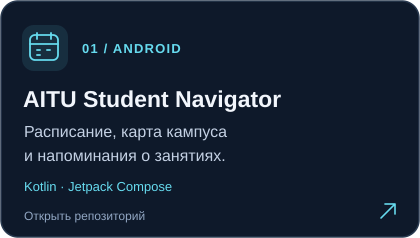
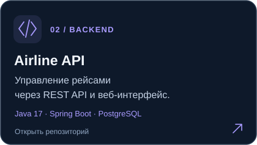
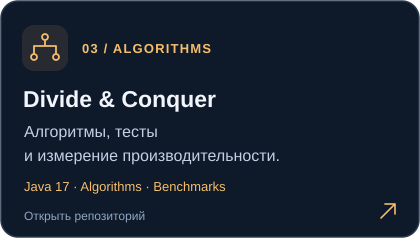
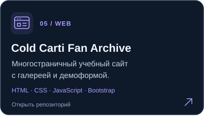

  

Развиваю учебные проекты на **Java, Kotlin и Python**: от алгоритмов и REST API до Android-приложения и адаптивного сайта.

В репозиториях — исходный код, инструкции запуска, проверки и ограничения проектов. Ниже можно открыть каждый проект и посмотреть, как он устроен.

## Избранные проекты

  
  

  
  

  

**Cold Carti Fan Archive** — совместный проект с **Zhaxylyk Alikhan**. Мой вклад: главная страница и страница связи, Bootstrap grid, карточки релизов, карусель, фильтр галереи и проверка формы. Распределение работы описано в [README проекта](https://github.com/kanatovs/music-bandv3#команда-и-страницы).

  <a href="https://kanatovs.github.io/music-bandv3/">Открыть сайт Cold Carti ↗</a>

